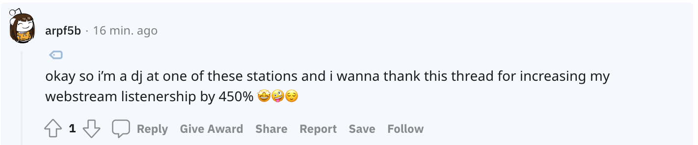

<a name="readme-top"></a>

[![Contributors][contributors-shield]][contributors-url]
[![Forks][forks-shield]][forks-url]
[![Stargazers][stars-shield]][stars-url]
[![Issues][issues-shield]][issues-url]
[![LinkedIn][linkedin-shield]][linkedin-url]

<!-- PROJECT LOGO -->
<br />
<div align="center">
    <a href="https://www.campus-fm.com/"></a>
  <p align="center">
    <br />
        <a href="https://www.campus-fm.com/"><strong>Use the app</strong></a> ·
        <a href="https://github.com/xehl/campus-fm/tree/main/src"><strong>Explore the repo</strong></a>
    <br />
  </p>
</div>

## About The Project

Campus FM allows you to live stream college radio stations around the country. Take a look at the first launch on Reddit [here](https://www.reddit.com/r/InternetIsBeautiful/comments/ydfvj9/campusfm_i_made_this_site_to_listen_to_college/), or check out the app [here](https://www.campus-fm.com/).

## Built With

- [![Javascript][javascript]][javascript-url]
- [![React][react.js]][react-url]
- [![Material UI][material-ui]][material-ui-url]
- [![NodeJS][node.js]][node-url]

<div align="center">
  
  
  <div style="display:flex;">
    
    
  </div>
  
  
</div>

<!-- GETTING STARTED -->

## Getting Started

To get a local copy of Campus FM up and running, follow these simple steps.

If you don't already have npm installed, make sure to install it via the command line:

```sh
npm install npm@latest -g
```

### Installation

1. Clone the repo
   ```sh
   git clone https://github.com/xehl/campus-fm.git
   ```
2. Install NPM packages
   ```sh
   npm install
   ```
3. Run the app
   ```js
   npm run start
   ```

<p align="right">(<a href="#readme-top">back to top</a>)</p>

<!-- MARKDOWN LINKS & IMAGES -->
<!-- https://www.markdownguide.org/basic-syntax/#reference-style-links -->

[contributors-shield]: https://img.shields.io/github/contributors/xehl/campus-fm.svg?style=for-the-badge
[contributors-url]: https://github.com/xehl/campus-fm/graphs/contributors
[forks-shield]: https://img.shields.io/github/forks/xehl/campus-fm.svg?style=for-the-badge
[forks-url]: https://github.com/xehl/campus-fm/network/members
[stars-shield]: https://img.shields.io/github/stars/xehl/campus-fm.svg?style=for-the-badge
[stars-url]: https://github.com/xehl/campus-fm/stargazers
[issues-shield]: https://img.shields.io/github/issues/xehl/campus-fm.svg?style=for-the-badge
[issues-url]: https://github.com/xehl/campus-fm/issues
[linkedin-shield]: https://img.shields.io/badge/-LinkedIn-black.svg?style=for-the-badge&logo=linkedin&colorB=555
[linkedin-url]: https://linkedin.com/in/eric-h-lee
[desktop-screenshot]: screengrabs/cfm-v1.5.png
[desktop-s-screenshot]: screengrabs/cfm-v1.5-select.png
[mobile-screenshot]: screengrabs/mobile-v1.5.png
[mobile-s-screenshot]: screengrabs/mobile-v1.5-select.png
[material-ui]: https://res.cloudinary.com/practicaldev/image/fetch/s--yayk2pWn--/c_limit%2Cf_auto%2Cfl_progressive%2Cq_auto%2Cw_880/https://img.shields.io/badge/Material--UI-0081CB%3Fstyle%3Dfor-the-badge%26logo%3Dmaterial-ui%26logoColor%3Dwhite
[material-ui-url]: https://mui.com/
[react.js]: https://img.shields.io/badge/React-20232A?style=for-the-badge&logo=react&logoColor=61DAFB
[react-url]: https://reactjs.org/
[javascript]: https://img.shields.io/badge/JavaScript-F7DF1E?style=for-the-badge&logo=javascript&logoColor=black
[javascript-url]: https://www.javascript.com/
[node.js]: https://img.shields.io/badge/Node.js-43853D?style=for-the-badge&logo=node.js&logoColor=white
[node-url]: https://nodejs.org/en/
