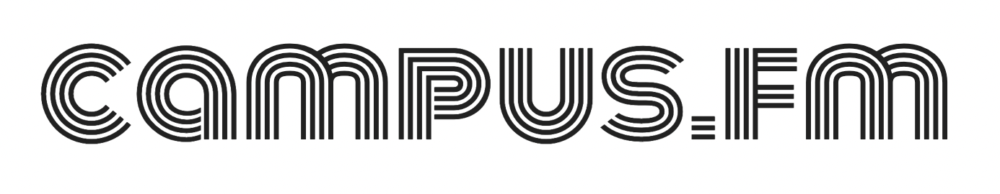

<!-- Improved compatibility of back to top link: See: https://github.com/othneildrew/Best-README-Template/pull/73 -->

<a name="readme-top"></a>

<!--
*** Thanks for checking out the Best-README-Template. If you have a suggestion
*** that would make this better, please fork the repo and create a pull request
*** or simply open an issue with the tag "enhancement".
*** Don't forget to give the project a star!
*** Thanks again! Now go create something AMAZING! :D
-->

<!-- PROJECT SHIELDS -->
<!--
*** I'm using markdown "reference style" links for readability.
*** Reference links are enclosed in brackets [ ] instead of parentheses ( ).
*** See the bottom of this document for the declaration of the reference variables
*** for contributors-url, forks-url, etc. This is an optional, concise syntax you may use.
*** https://www.markdownguide.org/basic-syntax/#reference-style-links
-->

[![Contributors][contributors-shield]][contributors-url]
[![Forks][forks-shield]][forks-url]
[![Stargazers][stars-shield]][stars-url]
[![Issues][issues-shield]][issues-url]
[![LinkedIn][linkedin-shield]][linkedin-url]

<!-- PROJECT LOGO -->
<br />
<div align="center">
    
  <p align="center">
    <br />
        <a href="https://campus-fm.netlify.app/"><strong>Open app on Netlify</strong></a> ·
        <a href="https://github.com/xehl/campus-fm"><strong>Explore the repo</strong></a>
    <br />
  </p>
</div>

[![Campus FM Screen Shot][product-screenshot]](screengrabs/cfm-v1.3.png)

## About The Project

Live stream college radio stations around the country. Check it out [here](https://campus-fm.netlify.app/).

## Built With

- [![React][react.js]][react-url]
- [![Material UI][material-ui]][material-ui-url]
- [![NodeJS][node.js]][node-url]

<!-- GETTING STARTED -->

## Getting Started

To get a local copy of Campus FM up and running, follow these simple steps.

If you don't already have npm installed, make sure to install it via the command line:

```sh
npm install npm@latest -g
```

### Installation

1. Clone the repo
   ```sh
   git clone https://github.com/xehl/campus-fm.git
   ```
2. Install NPM packages
   ```sh
   npm install
   ```
3. Run the app
   ```js
   npm run start
   ```

<!-- CONTACT -->

## Contact

Project Link: [https://github.com/xehl/campus-fm](https://github.com/xehl/campus-fm)

<p align="right">(<a href="#readme-top">back to top</a>)</p>

<!-- MARKDOWN LINKS & IMAGES -->
<!-- https://www.markdownguide.org/basic-syntax/#reference-style-links -->

[contributors-shield]: https://img.shields.io/github/contributors/xehl/campus-fm.svg?style=for-the-badge
[contributors-url]: https://github.com/xehl/campus-fm/graphs/contributors
[forks-shield]: https://img.shields.io/github/forks/xehl/campus-fm.svg?style=for-the-badge
[forks-url]: https://github.com/xehl/campus-fm/network/members
[stars-shield]: https://img.shields.io/github/stars/xehl/campus-fm.svg?style=for-the-badge
[stars-url]: https://github.com/xehl/campus-fm/stargazers
[issues-shield]: https://img.shields.io/github/issues/xehl/campus-fm.svg?style=for-the-badge
[issues-url]: https://github.com/xehl/campus-fm/issues
[linkedin-shield]: https://img.shields.io/badge/-LinkedIn-black.svg?style=for-the-badge&logo=linkedin&colorB=555
[linkedin-url]: https://linkedin.com/in/eric-h-lee
[product-screenshot]: screengrabs/cfm-v1.3.png
[material-ui]: https://res.cloudinary.com/practicaldev/image/fetch/s--yayk2pWn--/c_limit%2Cf_auto%2Cfl_progressive%2Cq_auto%2Cw_880/https://img.shields.io/badge/Material--UI-0081CB%3Fstyle%3Dfor-the-badge%26logo%3Dmaterial-ui%26logoColor%3Dwhite
[material-ui-url]: https://mui.com/
[react.js]: https://img.shields.io/badge/React-20232A?style=for-the-badge&logo=react&logoColor=61DAFB
[react-url]: https://reactjs.org/
[node.js]: https://img.shields.io/badge/Node.js-43853D?style=for-the-badge&logo=node.js&logoColor=white
[node-url]: https://nodejs.org/en/
